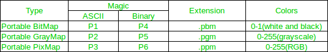

# image:

---

Esta cabezera permite la creacion de imagenes del tipo .pbm, .pgm y .ppm

## Compilacion:

git clone https://github.com/desmonHak/image.git
gcc -Wall exec.c -o exec.bin
./exec.bin

## Uso en codigo:

```c
#include "image.h"

int main()
{
    char name[] = "output"; // nombre de la imagen de salida
    image imagen = (image){ 
        .format = P1,       // formato
        .size_image = { .height = 10, .width = 10 }, // tamaño de la imagen
        .number_colors = MAX_NUMBER_COLORS_P3_P6, // numero de colores
        .name = name // nombre de la imagen
    };

    create_imagen_backfill(&imagen,(RGB){.blue = 0, .gren = 0, .red = 0}); // crear una imagen completa de blanco
    create_imagen_backfill_random(&imagen); // modiciar la imagen a colores aleatorios
    
    write_image(&imagen); // escribir la imagen
    image_info(&imagen);  // obbtener informacion de la imagen escritra
    free_data_image(&imagen); // liberar la imagen
    puts("Programa finalizado.\n");
}

```

---

Lista de los formatos, estructuras y cantidad de colores disponibles:


### Estructura `image`

```c
image imagen = (image){
    .format = P1,
    .size_image = { .height = 10, .width = 10 },
    .number_colors = MAX_NUMBER_COLORS_P3_P6,
    .name = name
}
```

- `format`: El miembro define el formato a usar. El sufijo `_A` para `ASCII` y el `_B` para `binario` posibles valoes:

| Formatos en ASCII | Formatos en binario | rangos                     |
| :---------------: | :-----------------: | :------------------------- |
|     `P1/P1_A`     |      `P4/P4_B`      | 0 - 1 (blanco y negro)     |
|     `P2/P2_A`     |      `P5/P5_B`      | 0 - 255 (escala de grises) |
|     `P3/P3_A`     |      `P6/P6_B`      | 0 - 255 (escala RGB)       |

- `size_image`: define el tamaño de la imagen, siendo `height` la altura y `width` la anchura.
- `number_colors`: se usa para definir el numero de rango de la tablas anteriores, no a de ser necesariamente el rango completo definido anteriormente, pero no puede exceder el maximos. Posibles valores:

  |      Valores maximos      | rangos                     |
  | :-----------------------: | :------------------------- |
  | `MAX_NUMBER_COLORS_P1_P4` | 0 - 1 (blanco y negro)     |
  | `MAX_NUMBER_COLORS_P2_P5` | 0 - 255 (escala de grises) |
  | `MAX_NUMBER_COLORS_P3_P6` | 0 - 255 (escala RGB)       |

- `name`: define el nombre del archivo de salida

Estructura completa
```c
typedef struct image
{
    formats  format;     // formato de la imagen
    extension extension; // extension de la extension usada
    char *name;          // nombre de la imagen
    char *full_name;     // nombre de la imagen completo con extension, es asignada tras llamar a assign_extension()

    struct contador{
        max_size_img_length contador_x;  // x
        max_size_img_length contador_y;  // y
    } contador;

    RGB **data; // datos de la imagen = matriz x * y

    struct size_image{
        max_size_img_length width;  // x
        max_size_img_length height; // y
    } size_image; // size total = width * height == x * y

    #if   MAX_NUMBER_COLORS == 0xff
        uint8_t number_colors;
    #elif MAX_NUMBER_COLORS == 0xffff
        uint16_t number_colors;
    #elif MAX_NUMBER_COLORS == 0xffffffff
        uint32_t number_colors;
    #elif MAX_NUMBER_COLORS == 0xffffffffffffffff
        uint64_t number_colors;
    #else 
        #error "MAX_NUMBER_COLORS must be 0xff, 0xffff, 0xffffffff or 0xffffffffffffffff"
    #endif
} image;
```

---

# Ejemplo de ejecucion:


---
